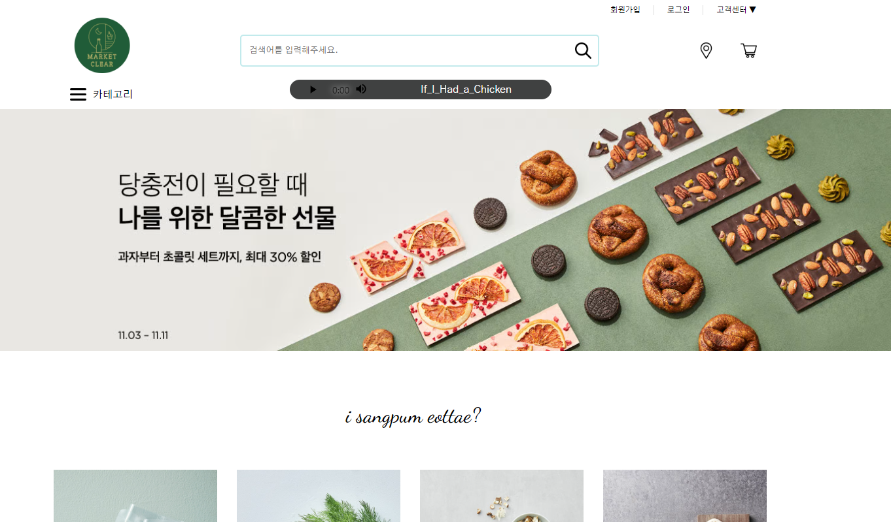
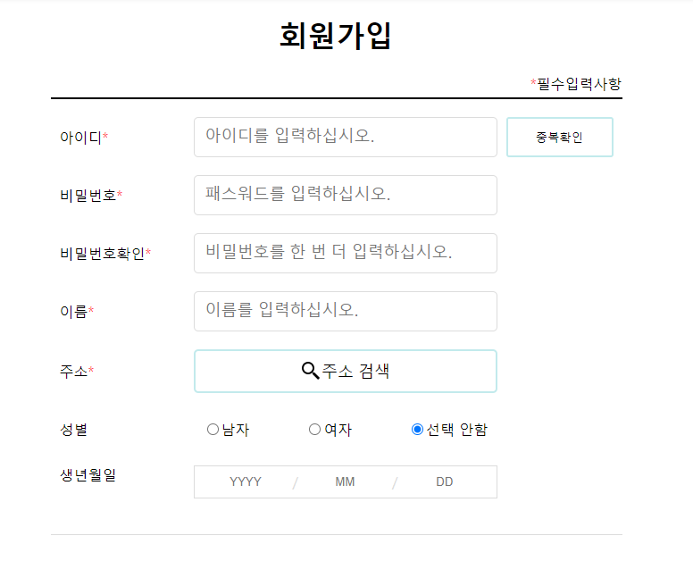
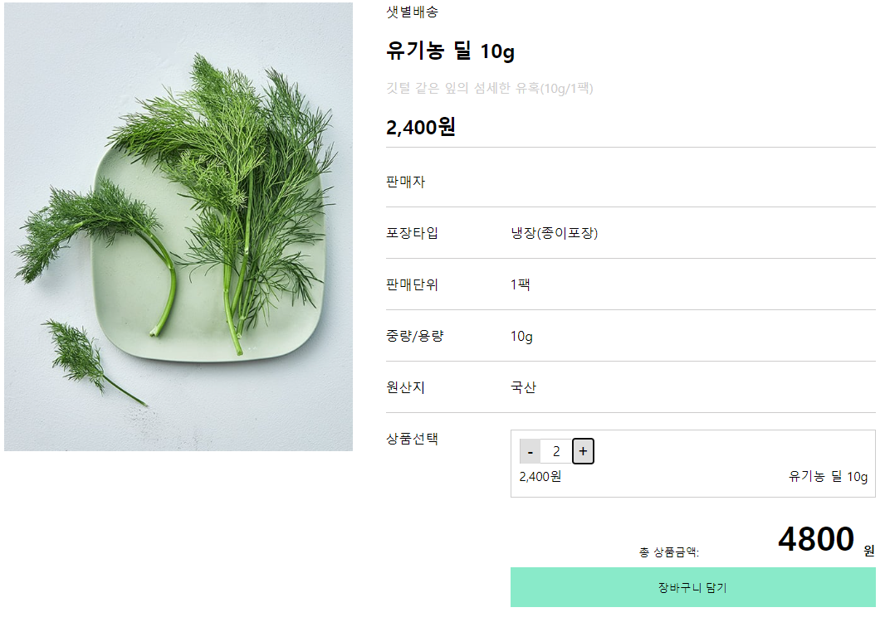
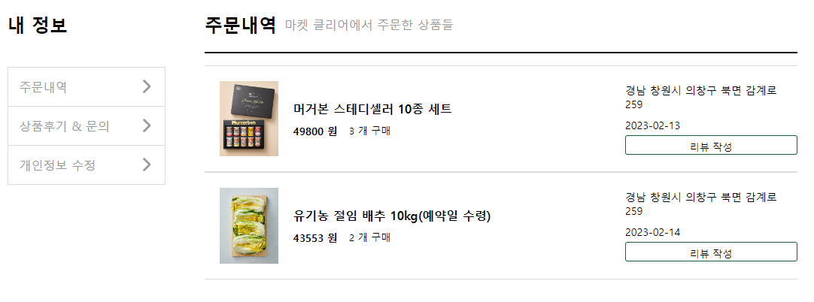

# CodeClear

- 기간 : 2022.10.31 ~ 2022.11.11
- 팀 : 김정규 김선주 고우석 염예나
 
- Market Curley 홈페이지를 참조하여 쇼핑몰 사이트를 만들어 봤습니다.
 
### 구현한 기능
 

1. 메인 페이지

2. 카테고리별 페이지

3. 제품별 상세 페이지

 
### 사용 기술 스택
 
</a>
</a>
</a>
</a>
</a>
 
### 이슈 사항 및 해결
 

이슈 1. 장바구니 Background-Image CSS 부분적으로 보여지는 이슈

원인. 이미지에 바로 Background-Color를 적용 후 padding + border-radius를 적용할 경우의 이슈

해결. button에 Backgrount-Image로 CSS에 적용하여 padding + border-radius를 적용하여 문제 해결

 

이슈 2. 메인 페이지 카테고리별 슬라이드 반응 이슈

원인. 하나의 카테고리 슬라이드를 만들어 좌우 버튼 클릭 시 다른 카테고리도 같이 반응하는 이슈

해결. 각각의 슬라이드마다 다른 id를 부여하여 해결 (리팩토링 필요한 부분)

 
### 소감
  
  - 처음엔 프론트와 백으로 역할을 확실히 나눠서 각각 맡은 분야만 잘 해도 굴러가는 프로젝트를 상상했습니다.
  - 하지만 프론트가 요청할 내용을 미리 백에서 추상화, 일반화 해서 미리 구현하는 기술이 모자랐기 때문에 백과 프론트의 진도가 같이 나갈 수 없는 문제가 발생했습니다.
  - 따라서 프론트를 구현하다 필요한 요청이 있다면 필요한 사람이 직접 서버에 구현하는 방식으로 진행하게 되었습니다.
  - 다만 이땐 비슷한 기능을 여러 사람이 필요할 경우가 있는데 (ex) => 제품 정보를 db에서 불러오는 것. 
  - 이미 구현된 요청을 중복해서 구현하는 손해가 생겼습니다.
  - 다음 프로젝트에선 이런 부분에 대한 고려가 필요하다 느꼈습니다.
 

</img>

</img>
   

</img>

</img>
 

